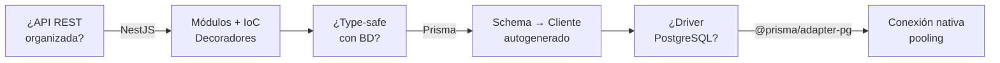

# 02 — Stack tecnológico

## Tecnologías principales

| Capa | Tecnología | Versión | ¿Para qué? |
|---|---|---|---|
| Runtime | Node.js | 24.15.0 | Ejecuta JavaScript en el servidor |
| Framework | NestJS | 11.x | Estructura la API con módulos, controladores y servicios |
| ORM | Prisma | 7.x | Conecta y consulta PostgreSQL con type-safety |
| Adapter | `@prisma/adapter-pg` | 7.x | Permite que Prisma use el driver `pg` nativo |
| Driver | `pg` | 8.x | Driver de PostgreSQL para Node.js |
| BD | PostgreSQL | 18 (Alpine) | Base de datos relacional |
| Idioma | TypeScript | 5.x | JavaScript con tipos estáticos |

---

## Dependencias clave

### Producción

```json
"@nestjs/common"         // Decoradores, guards, pipes
"@nestjs/config"         // Variables de entorno
"@nestjs/core"           // IoC container, módulos
"@nestjs/jwt"            // Firma/verificación de JWT (login trabajadores)
"@nestjs/mapped-types"   // PartialType para Update DTOs
"@nestjs/platform-express" // Servidor HTTP Express
"@nestjs/swagger"        // OpenAPI + Swagger UI
"@nestjs/terminus"       // Health checks
"@nestjs/axios"          // HTTP client (integraciones + health)
"@prisma/client"         // Cliente generado por Prisma
"@prisma/adapter-pg"     // Adaptador PostgreSQL
"pg"                     // Driver PostgreSQL
"axios"                  // HTTP client (integraciones)
"bcryptjs"               // Hash de passwords (login + seed)
"class-transformer"      // @Transform, @Expose/@Type, toResponse*
"class-validator"        // @IsEmail, @IsEnum... (ValidationPipe global)
"cloudinary"             // SDK de Cloudinary
"multer"                 // Upload de archivos (multipart)
"reflect-metadata"       // Decoradores en tiempo de ejecución
"rxjs"                   // Programación reactiva
```

### Desarrollo

```json
"@nestjs/cli"            // Generar módulos, controladores
"@nestjs/schematics"     // Plantillas de código
"@nestjs/testing"        // Test utilities
"@eslint/eslintrc"       // Configuración de ESLint
"@eslint/js"             // Reglas base de ESLint
"@types/*"               // Tipos (bcryptjs, express, jest, node, pg...)
"typescript"             // Compilador TS
"typescript-eslint"      // ESLint + TypeScript
"ts-jest"                // Jest + TypeScript
"ts-node"                // Ejecutar TS directamente
"tsx"                    // Runner TS (seed: npm run db:seed)
"tsconfig-paths"         // Resolución de path aliases
"prisma"                 // CLI de Prisma
"jest + supertest"       // Tests unitarios y E2E
"eslint + prettier"      // Linter y formateador
```
---

## ¿Por qué estas tecnologías?



---

## Versiones de Node soportadas

El proyecto requiere **Node.js 24.15.0** exactamente (definido en `.nvmrc` y `package.json`).

```bash
nvm use        # Activar la versión correcta
node --version # → v24.15.0
```

---

## Política de versiones `@nestjs/*`

En el ecosistema Nest, el **major de los paquetes `@nestjs/*` acompaña al major del framework**: con `@nestjs/common` en `11.x`, todo paquete `@nestjs/*` nuevo debe instalarse en su línea `11.x` (ej. `@nestjs/swagger@^11`, `@nestjs/terminus@^11`).

Instalar sin fijar el major trae la última versión, que puede pedir otro Nest y romper la instalación con `ERESOLVE` (ver [troubleshooting](./08-convenciones.md)). Antes de agregar un paquete `@nestjs/*`:

```bash
# 1. Ver qué majors existen
npm view @nestjs/swagger versions --json | tail -5

# 2. Confirmar que sus peers piden nuestro Nest (11.x)
npm view @nestjs/swagger@11 peerDependencies

# 3. Instalar fijando el major compatible
npm install --save @nestjs/swagger@^11
```

Fuente oficial de equivalencias: los [releases en GitHub](https://github.com/nestjs/swagger/releases) de cada paquete documentan con qué Nest va cada major (ej. swagger v11 → Nest 11, v12 → Nest 12). Nunca uses `--force` ni `--legacy-peer-deps` para tapar el conflicto.

---

[&larr; Anterior: Introducción](./01-introduccion.md) | [Siguiente: Arquitectura &rarr;](./03-arquitectura.md)
