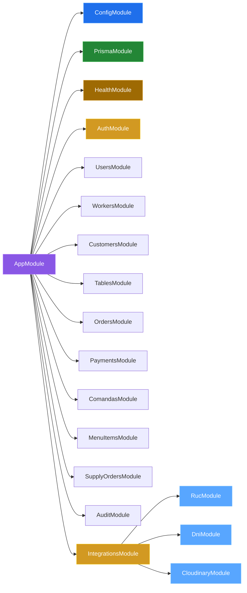
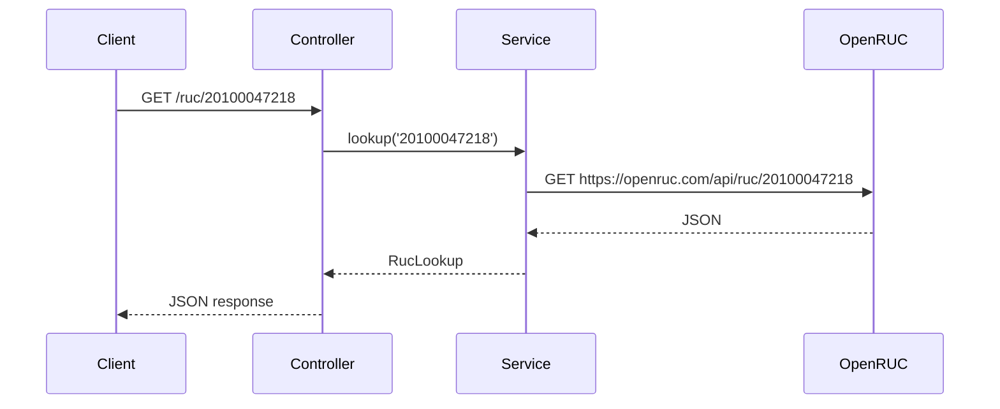

# 03 — Arquitectura de módulos

## Árbol de módulos

---

## Módulos de dominio

| Módulo | Responsabilidad | Prefijo HTTP |
|---|---|---|
| `AuthModule` | Login trabajador (JWT), guards globales | `/auth` |
| `UsersModule` | Identidad: `Usuario` por email/tipo (sin controller) | — |
| `WorkersModule` | Gestión de trabajadores (CRUD, activar, baja) | `/workers` |
| `CustomersModule` | Clientes digitales | `api/customers` |
| `TablesModule` | Mesas del local | `api/tables` |
| `OrdersModule` | Pedidos | `api/orders` |
| `PaymentsModule` | Pagos + detalles | `api/payments` |
| `ComandasModule` | Comandas, cocina y movimientos | `api/comandas` |
| `MenuItemsModule` | Platos del menú (solo lectura) | `api/menu-items` |
| `SupplyOrdersModule` | Órdenes de abasto + métricas | `/supply-orders` |
| `AuditModule` | Auditoría del sistema | `api/audit` |

Detalle de endpoints en [07 — API](./07-api.md). Reglas transversales (guards, roles, entities) en [08 — Convenciones](./08-convenciones.md).

---

## AppModule (raíz)

```typescript
@Module({
  imports: [
    ConfigModule.forRoot({ isGlobal: true }),
    PrismaModule,       // global: PrismaService en toda la app
    HealthModule,
    AuthModule,         // + JwtAuthGuard / RolesGuard globales (APP_GUARD)
    UsersModule,        // identidad (sin controller)
    WorkersModule,
    CustomersModule,
    TablesModule,
    OrdersModule,
    PaymentsModule,
    ComandasModule,
    MenuItemsModule,
    SupplyOrdersModule,
    AuditModule,
    IntegrationsModule, // ruc + dni + cloudinary
  ],
  controllers: [AppController],
  providers: [
    AppService,
    { provide: APP_GUARD, useClass: JwtAuthGuard }, // auth en todo salvo @Public()
    { provide: APP_GUARD, useClass: RolesGuard },   // @Roles() por controller/método
  ],
})
export class AppModule {}
```

> Los guards son globales: toda ruta exige JWT salvo `@Public()` (`POST /auth/login`, `/health`), y las rutas con `@Roles()` exigen además el rol (ver [convenciones](./08-convenciones.md)).

---

## PrismaModule (global)

```typescript
@Global()
@Module({
  providers: [PrismaService],
  exports: [PrismaService],
})
```

- **Global**: cualquier módulo inyecta `PrismaService` sin importarlo
- Extiende `PrismaClient` usando `@prisma/adapter-pg`
- Lee `DATABASE_URL` desde `ConfigService`

## HealthModule

Expone `GET /health` (público) con dos niveles:

| Endpoint | Indicador | Qué verifica |
|---|---|---|
| `GET /health` (readiness) | `database` | Ping PostgreSQL (timeout 2 s) |
| `GET /health/live` (liveness) | `memory_heap` | Heap < 300 MB, sin I/O |

---

## IntegrationsModule (agrupador)

Consultas externas de identidad (sin persistencia):

| Submódulo | Proveedor | Endpoint |
|---|---|---|
| `RucModule` | OpenRUC | `GET /ruc/:numero` |
| `DniModule` | ApiInti | `GET /dni/:numero` |
| `CloudinaryModule` | Cloudinary | `POST /media/upload`, `DELETE /media` |

Detalle en [09 — DNI/RUC](./09-integraciones-dni-ruc.md) y [10 — Cloudinary](./10-cloudinary.md).

---

## Flujo de una petición



---

## Patrón por módulo

```
modulo/
├── modulo.module.ts      # @Module({ controllers, providers, exports })
├── modulo.controller.ts  # @Controller() con rutas HTTP
├── modulo.service.ts     # @Injectable() con lógica de negocio
├── dto/                  # Data Transfer Objects
├── entities/             # Modelos / entidades
└── *.spec.ts             # Tests
```

---

[&larr; Anterior: Stack](./02-stack.md) | [Siguiente: Base de datos &rarr;](./04-base-de-datos.md)
