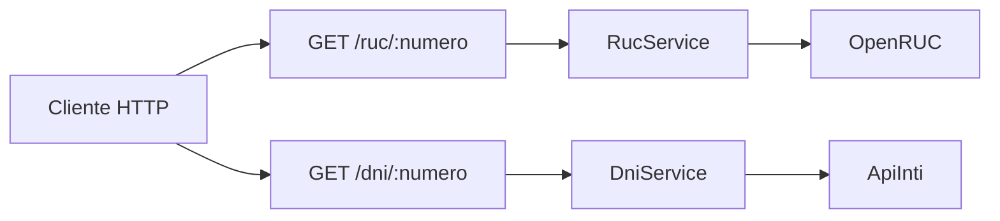

# 09 — Integraciones DNI / RUC

Consultas funcionales de identidad tributaria y personal. No usan las APIs oficiales de RENIEC/SUNAT; delegan en proveedores HTTP públicos o freemium.



---

## RUC — OpenRUC

| Concepto | Valor |
|---|---|
| Endpoint local | `GET /ruc/:numero` |
| Proveedor | `GET {OPENRUC_BASE_URL}/ruc/{ruc}` |
| Auth | Ninguna |
| Validación | Exactamente 11 dígitos |

```bash
curl http://localhost:3000/ruc/20100047218
```

Respuesta:

```json
{
  "ruc": "20100047218",
  "razonSocial": "BANCO DE CREDITO DEL PERU",
  "estado": "ACTIVO",
  "condicion": "HABIDO",
  "direccion": "JR. CENTENARIO NRO 156 URB. LADERAS DE MELGAREJO",
  "ubigeo": "150114",
  "source": "SUNAT",
  "asOf": "2026-05-30"
}
```

---

## DNI — ApiInti

| Concepto | Valor |
|---|---|
| Endpoint local | `GET /dni/:numero` |
| Proveedor | `GET {APIINTI_BASE_URL}/dni/{numero}` |
| Auth | `Authorization: Bearer {APIINTI_API_KEY}` |
| Validación | Exactamente 8 dígitos |

Obtén la key en [app.apiinti.dev](https://app.apiinti.dev) y colócala en `.env` como `APIINTI_API_KEY`.

```bash
curl http://localhost:3000/dni/12345678
```

Respuesta:

```json
{
  "dni": "12345678",
  "nombres": "JUAN CARLOS",
  "apellidoPaterno": "PEREZ",
  "apellidoMaterno": "GARCIA",
  "nombreCompleto": "PEREZ GARCIA JUAN CARLOS"
}
```

---

## Variables de entorno

| Variable | Default | Descripción |
|---|---|---|
| `OPENRUC_BASE_URL` | `https://openruc.com/api` | Base del proveedor RUC |
| `APIINTI_BASE_URL` | `https://app.apiinti.dev/api/v1` | Base del proveedor DNI |
| `APIINTI_API_KEY` | _(vacío)_ | Bearer token de ApiInti |

---

## Errores

| Código | Cuándo |
|---|---|
| 400 | Formato inválido (RUC ≠ 11 / DNI ≠ 8) |
| 401 | Falta o es inválida `APIINTI_API_KEY` |
| 404 | Número no encontrado en el proveedor |
| 429 | Rate limit del proveedor |
| 503 | Proveedor caído o sin respuesta útil |

---

## Código

```
src/integrations/
├── integrations.module.ts
├── ruc/          # OpenRUC
└── dni/          # ApiInti
```

Los servicios se pueden inyectar desde otros módulos (`exports` en `RucModule` / `DniModule`) para autocompletar proveedores o clientes.

---

[&larr; Anterior: Convenciones](./08-convenciones.md) | [Siguiente: Cloudinary &rarr;](./10-cloudinary.md)
