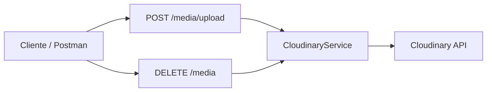

# 10 — Cloudinary (media)

Subida y borrado de imágenes vía Cloudinary. El frontend no debe usar secretos; todo pasa por este servicio del backend.



---

## Endpoints

### `POST /media/upload`

Multipart form-data. Campo del archivo: `file`. Carpeta opcional: query `folder`.

```bash
curl -X POST "http://localhost:3000/media/upload?folder=turtle/supplies" \
  -F "file=@./foto.png"
```

Respuesta `201`:

```json
{
  "publicId": "turtle/supplies/abc123",
  "url": "http://res.cloudinary.com/.../image/upload/...",
  "secureUrl": "https://res.cloudinary.com/.../image/upload/...",
  "format": "png",
  "bytes": 20480,
  "width": 640,
  "height": 480,
  "resourceType": "image",
  "folder": "turtle/supplies"
}
```

Límites:
- MIME: `image/jpeg`, `image/png`, `image/webp`, `image/gif`
- Tamaño máximo: **5 MB**

### `DELETE /media`

```bash
curl -X DELETE http://localhost:3000/media \
  -H "Content-Type: application/json" \
  -d '{"publicId":"turtle/supplies/abc123"}'
```

Respuesta `200`:

```json
{
  "publicId": "turtle/supplies/abc123",
  "result": "ok"
}
```

---

## Variables de entorno

| Variable | Descripción |
|---|---|
| `CLOUDINARY_CLOUD_NAME` | Cloud name del dashboard |
| `CLOUDINARY_API_KEY` | API key |
| `CLOUDINARY_API_SECRET` | API secret |
| `CLOUDINARY_FOLDER` | Carpeta por defecto (`turtle`) |

Credenciales en [Cloudinary Console](https://console.cloudinary.com/).

---

## Errores

| Código | Cuándo |
|---|---|
| 400 | Sin archivo, MIME no permitido o > 5 MB |
| 401 | Credenciales Cloudinary no configuradas |
| 503 | Fallo al hablar con Cloudinary |

---

## Código

```
src/integrations/cloudinary/
├── cloudinary.module.ts
├── cloudinary.controller.ts
├── cloudinary.service.ts
├── cloudinary.provider.ts
├── cloudinary.constants.ts
├── dto/
└── entities/
```

`CloudinaryService` se exporta para usarlo desde módulos de insumos/menú (guardar `secureUrl` / `publicId` en BD).

---

[&larr; Anterior: DNI / RUC](./09-integraciones-dni-ruc.md) | [Volver al inicio](./README.md)
